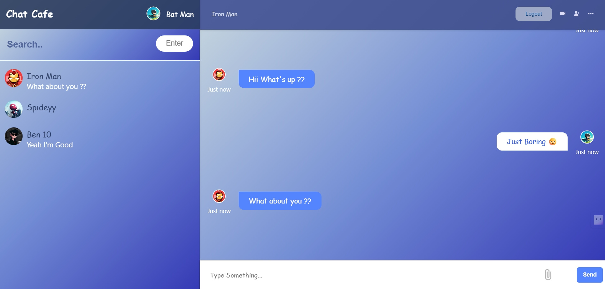

# Chat Cafe — Real-Time Chat Application

## 🚀 Live Demo
> **[https://chat-cafe.netlify.app](https://chat-cafe.netlify.app)**

---

## 📸 Screenshots

### 🔐 Authentication


### 💬 Chat Interface



### 👥 User Search


---

## ⚡ Features

- Secure user authentication (register/login)
- Real-time messaging using WebSockets
- User search and conversation selection
- Support for emojis and media messages
- Instant UI updates without page reload

## 🧠 System Flow

- User authenticates via REST API
- Frontend establishes WebSocket connection
- Messages are emitted using Socket.io
- Server processes and forwards messages to recipient
- UI updates instantly without page reload

## 🛠️ Tech Stack

Frontend:
- React.js
- CSS / SCSS

Backend:
- Node.js
- Express.js

Realtime Communication:
- Firebase (Firestore / Realtime Database)

Database:
- MongoDB

---

## ⚙️ How to Run

### Clone repo

```bash
git clone <repo-url>
```

### Install dependencies

```bash
npm install
```

### Run frontend

```bash
npm start
```

### Run backend

```bash
npm run server
```

---

## 📂 Project Structure

```
realtime-chat-application/
├── client/                   # Frontend application
│   ├── src/
│   │   ├── components/       # React components
│   │   │   ├── Chat.jsx
│   │   │   ├── Login.jsx
│   │   │   ├── Register.jsx
│   │   │   ├── Sidebar.jsx
│   │   │   └── ...
│   │   ├── contexts/         # Context API
│   │   ├── hooks/            # Custom hooks
│   │   ├── services/         # API services
│   │   ├── App.jsx           # Main application
│   │   ├── index.js          # Entry point
│   │   └── ...
│   └── package.json
├── server/                   # Backend application
│   ├── controllers/          # Request handlers
│   ├── models/               # Mongoose models
│   ├── routes/               # API routes
│   ├── server.js             # Server entry point
│   └── ...
├── .env.example              # Environment variables
├── README.md                 # Project documentation
└── screenshots/              # Screenshots
    ├── login.png
    ├── register.png
    ├── chat-sender.png
    ├── chat-receiver.png
    └── user-search.png
```
